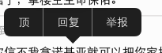

# MenuController
拷贝，复制，粘贴等功能重定义，重实现 - UIMenuController

## UIMenuController的示例


## UIMenuController须知
- 默认情况下, 有以下控件已经支持UIMenuController
    - UITextField
    - UITextView
    - UIWebView

## 让其他控件也支持UIMenuController(比如UILabel)
- 自定义UILabel
- 重写2个方法

```
/**
 * 让label有资格成为第一响应者
 */
- (BOOL)canBecomeFirstResponder
{
    return YES;
}

/**
 * label能执行哪些操作(比如copy, paste等等)
 * @return  YES:支持这种操作
 */
- (BOOL)canPerformAction:(SEL)action withSender:(id)sender
{
    if (action == @selector(cut:) || action == @selector(copy:) || action == @selector(paste:)) return YES;

    return NO;
}
```

- 实现各种操作方法

```
- (void)cut:(UIMenuController *)menu
{
    // 将自己的文字复制到粘贴板
    [self copy:menu];

    // 清空文字
    self.text = nil;
}

- (void)copy:(UIMenuController *)menu
{
    // 将自己的文字复制到粘贴板
    UIPasteboard *board = [UIPasteboard generalPasteboard];
    board.string = self.text;
}

- (void)paste:(UIMenuController *)menu
{
    // 将粘贴板的文字 复制 到自己身上
    UIPasteboard *board = [UIPasteboard generalPasteboard];
    self.text = board.string;
}
```
- 让label成为第一响应者

```
// 这里的self是label
[self becomeFirstResponder];
```

- 显示UIMenuController

```
UIMenuController *menu = [UIMenuController sharedMenuController];
// targetRect: MenuController需要指向的矩形框
// targetView: targetRect会以targetView的左上角为坐标原点
[menu setTargetRect:self.bounds inView:self];
// [menu setTargetRect:self.frame inView:self.superview];
[menu setMenuVisible:YES animated:YES];
```

## 自定义UIMenuController内部的Item
- 添加item

```
// 添加MenuItem(点击item, 默认会调用控制器的方法)
UIMenuItem *ding = [[UIMenuItem alloc] initWithTitle:@"顶" action:@selector(ding:)];
UIMenuItem *replay = [[UIMenuItem alloc] initWithTitle:@"回复" action:@selector(replay:)];
UIMenuItem *report = [[UIMenuItem alloc] initWithTitle:@"举报" action:@selector(report:)];
menu.menuItems = @[ding, replay, report];
```
